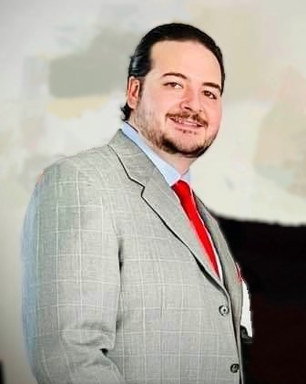

# Portfolio

## Intro
My name is Matthew Clockel, and I have a bachelors degree in computer science with a major in software engineering from Southern New Hampshire Univeristy. I currently have completed two internships in application development with Centricity and Bankers Insurance Group.  I have been programming in many different languages for over four years.  

This ePortfolio will showcase seven artifacts in:
- Software Design and Engineering
- Algorithms and Data Structures (Android Studio, Java)
- Databases (JMP)
- Search and Rescue Animal Application (MongoDB, Python, Dash, Pymongo, Jupyter Notebook)
- Mission Planner (Angular, NodeJs, Typescript, Javascript)
- Orbit Report (Angular, NodeJs, Typescript, Javascript)
- Tech Jobs Console Persistent (Java, Springboot, MySQL Server)

## Professional Self-Assessment
  Computer science has always been a passion of mine.  From an early age, I began my journey on an MS-Dos computer loading floppy disks and typing in the command line.  Today I am proficiant in full stacks development.  I obtained my bachelors degree in early 2022.  Southern New Hampshire University has taught me valuable skills in computer science that will excel my professional career.  

During this educational journey, I have also completed two internships.  The two internships were completed with Bankers Financial Corporation.  Within Bankers Financial Corporation I worked in two seperate branches within the corporation.  The first three months I worked with Bankers Insurance Group as an application developmer intern which deals with home insurances.  I worked on the agent and customer application.  This internship taught me a lot about how to work in development team with a Scrum Agile methodology.  I became proficient in git source control working with the developers and completeing the assigned stories.  The application was Angular development with API's.  I learned how to work on the application in C# and ASP.NET core development. Once my code was finished and tested, I created releases with Azure DevOps and would deploy these releases into the int, sqa, and prd environments.
  
  The second internship with Bankers Financial Corporation was with Centricity branch.  This internship I worked with the development team which was also Scrum Agile.  The purpose of my internship was to help migrate legacy software into a new modern platform that will reduce the amount of work for the team.  The migration was to move the data into Airtables and Windward templates.  The Windward templates would be populated with the JSON databases that were stored in Airtables.  I had to commit my work using Git source control and also create releases in Azure DevOps. 
  
  I have also completed the Launchcode LC101 course.  This course was a full time six month classroom web development course that teaches full stack skills.  The curriculum included the foundational programming concepts and front-end programming in JavaScript with testing and Angular framework.  The course also taught full-stack web application development using java with Spring Boot frame work with C#, .NET MVC, and MySQL databases.
  
## Collaborative Environments
I have learned the importance of code review in a collaborative environment.  Once I have tested my own code and feel strong that the code is ready to merge into the master branch, sending the code to be reviewed by other developers of the team with a pull request will ensure the code is ready for production.  This will allow team collaboration and a new perspective that can enhance the code.

## Secure Coding
Southern New Hampshire University has taught me secure coding best practices.  With zero trust principles in mind, developing code that has security layers will help limit vulnerabilities.  Software will have many vulnerabilities if secure coding practices are not incorporated.  A security vulnerability is weaknesses in software that allow hackers to gain unauthorized access.  Secure coding includes preventing vulnerabilities such as buffer overflow and SQL injections.  

Buffer overflows is a type of vulnerability identifiable in C++ code.  This happens when the more characters are entered within a fixed length input.  When this happens, the output can contain arbitrary code exposing potential data like passwords.    Preventing more characters to be inputted than the max amount is a way to prevent this security vulnerability.

Another type of vulnerability in C++ code is SQL injection.  This type of attack injects SQL statements into input fields that run within the database.  When coding, using secure coding practices to prevent this type of attack will be helpful.  Preventing words to be inputted like SELECT, FROM and other SQL commands will prevent this type of attack.

Finding vulnerabilities during legacy to C++ conversion will help enhance the secure coding practices following the zero-trust policy.  This will help identify any vulnerabilities now to be able to add them to the testing stage. There may be vulnerabilities in the legacy code that will not normally be tested in the testing stage.  Identifying these first then applying test to prevent them.  The appropriate fix to a security vulnerability will depend on the vulnerability.  Identify the vulnerabilities then one can setup layers of security to prevent these attacks.

## Code Review
<iframe width="650" height="400" src="https://www.youtube.com/embed/r6bnArzCaMc" frameborder="0" allow="accelerometer; autoplay; encrypted-media; gyroscope; picture-in-picture" allowfullscreen></iframe>

## Software Design and Engineering
This artifact are software diagrams for students and teachers to register for classes with CRUD functionality.  This included SIS sequence diagrams to show the process of the user interface.   This artifact was created in January of 2021. 

[**Artifact 1 Details**](artifact1.md)

## Algorithms and Data Structures
This artifact is an android application that is an inventory application.  This inventory application has user authentication and credentials.  The inventory app also allows the user to add inventory items with CRUD functionality.  This artifact uses two SQLite databases to store user and inventory item information.  This artifact was created in October of 2021.

[**Artifact 2 Details**](artifact2.md)

## Databases
 The artifact is a data mining report for the Bubba Gump Shrimp Company.  The CSV file database is a collection of customer and restaurant information.  The data mining report includes a statistical analysis with graphs to discover new information about the data that one may not see looking at the data itself.  This artifact was created in April of 2021.
 
[**Artifact 3 Details**](artifact3.md)

## Search and Rescue Animal Application
 The artifact is for an innovative international rescue-animal training company called Grazioso Salvare. This software is used to identify dogs that will qualify for the search and rescue training. The project collects and sorts the animal data from the MongoDB database. Filtering the data for the desired traits such as age and breed will help find the qualified rescue dogs. Some dog breeds are more proficient than others for different types of rescues. Training dogs that are not more than two years has been shown to be more effective. The search and rescue animal application is designed to search and filter animals by rescue type and animal breed. The web application dashboard uses CRUD functionality to filter through the database. CRUD functionality allows the app to be maintanable for future updates. The advantages of CRUD functionality is that users will be able to create, read, update, and delete data within the database. This functionality can be applied to many different applications besides search and rescue animals.  This artifact was created in August of 2021.
 
[**Artifact 4 Details**](artifact4.md)

## Mission Planner
 This artifact is a web application that helps plan for space missions.  The user can select up to three candidates to make a crew for the space mission.  When the user clicks the candidate they name is highlighted green and listed under the crew column.  If the user moves the mouse over the crew member, a picture of the astronaut will be shown.  The misson also alows the user to select up to 10 pieces of cargo or maximum of 2000 kg which ever comes first. The add to cargo hold button will fade out and be unclickable if the item will exceed the maximum mass.   The amount of mas available and remaining is displayed and changes as items are added to the cargo hold.  There is an empy hold button that will reset the dashboard.  This artifact was created in June of 2020.
 
[**Artifact 5 Details**](artifact5.md)

## Orbit Report
 There are thousands of satellites orbiting the earth. The Orbit is a searchable, sortable table of satellites.  The search form filters search results based on matches to the entered text.  The columns Name and Type are sortable when clicked. This artifact was created in June of 2020.
 
[**Artifact 6 Details**](artifact6.md)

## Tech Jobs Console Persistent
 This is a Spring Boot web application coded in java. This application allows you to browse and search listings of open jobs by employers.  The application connects to MySQL Server database to store user-submitted job data.  This artifact was created in Sept of 2020.
 
[**Artifact 7 Details**](artifact7.md)

